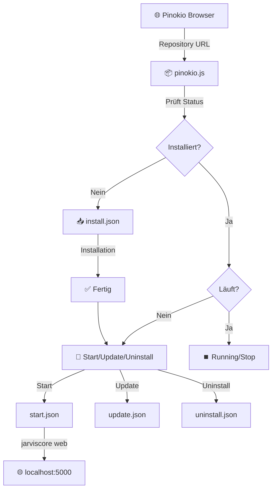

# 🎯 JarvisCore + Pinokio Integration

> **One-Click Installation & Management für JARVIS Core System**

---

## 📊 Workflow-Übersicht



---

## 🔄 Installations-Pipeline

```
┌─────────────────────────────────────────────────────────────────┐
│                    PINOKIO INSTALLATION                         │
└─────────────────────────────────────────────────────────────────┘

      USER KLICKT "INSTALL"  
              │
              ▼
┌──────────────────────────────────────────────────────────────────┐
│ PHASE 1: Git Clone                                               │
├──────────────────────────────────────────────────────────────────┤
│ Command: git clone https://github.com/Lautloserspieler/         │
│          JarvisCore app                                          │
│ Output:  app/                                                    │
│ Dauer:   ~30s                                                    │
│ Status:  [████████████████████] 100%                             │
└──────────────────────────────────────────────────────────────────┘
              │
              ▼
┌──────────────────────────────────────────────────────────────────┐
│ PHASE 2: Python Virtual Environment + Dependencies              │
├──────────────────────────────────────────────────────────────────┤
│ Command: pip install -e ".[tts]"                                 │
│ Path:    app/ (in venv)                                          │
│ Installiert:                                                     │
│   ✅ FastAPI                 (Backend Server)                     │
│   ✅ uvicorn                 (ASGI Server)                        │
│   ✅ llama-cpp-python        (AI Engine)                         │
│   ✅ XTTS v2                 (Text-to-Speech)                    │
│   ✅ PyTorch                 (Deep Learning)                     │
│   ✅ numpy, scipy            (Numerik)                           │
│   ✅ requests, aiohttp       (HTTP)                              │
│   ✅ websockets              (WebSocket)                         │
│   ✅ + ~50 weitere Packages                                      │
│ Dauer:   ~2-5 Minuten                                            │
│ Size:    ~1.5 GB                                                 │
│ Status:  [████████████████████] 100%                             │
└──────────────────────────────────────────────────────────────────┘
              │
              ▼
┌──────────────────────────────────────────────────────────────────┐
│ PHASE 3: Frontend Dependencies                                   │
├──────────────────────────────────────────────────────────────────┤
│ Command: npm install                                             │
│ Path:    app/frontend/                                           │
│ Installiert:                                                     │
│   ✅ Vue 3                   (Frontend Framework)                │
│   ✅ Vite                    (Build Tool)                        │
│   ✅ TypeScript              (Type Safety)                       │
│   ✅ Axios                   (HTTP Client)                       │
│   ✅ Socket.IO Client        (WebSocket)                         │
│   ✅ + ~100 weitere Packages                                     │
│ Dauer:   ~1-2 Minuten                                            │
│ Size:    ~1 GB                                                   │
│ Status:  [████████████████████] 100%                             │
└──────────────────────────────────────────────────────────────────┘
              │
              ▼
┌──────────────────────────────────────────────────────────────────┐
│ ✅ INSTALLATION COMPLETE                                         │
├──────────────────────────────────────────────────────────────────┤
│ 🎉 Notification: "Installation complete!                         │
│                  Click 'Start' to launch JARVIS."                │
│                                                                  │
│ Gesamt-Zeit: 4-8 Minuten                                         │
│ Gesamt-Size: ~3.5 GB                                             │
└──────────────────────────────────────────────────────────────────┘
```

---

## 🚀 Start-Prozess

```
┌─────────────────────────────────────────────────────────────────┐
│                      USER KLICKT "START"                        │
└─────────────────────────────────────────────────────────────────┘
              │
              ▼
┌──────────────────────────────────────────────────────────────────┐
│ STEP 1: Launch Application                                       │
├──────────────────────────────────────────────────────────────────┤
│ Command: jarviscore web                                          │
│ Path:    app/ (in venv)                                          │
│                                                                  │
│ ┌────────────────────────────────────────────────────────────┐  │
│ │ Backend startet...                                         │  │
│ │ ├─ FastAPI Server         → http://localhost:5050         │  │
│ │ ├─ WebSocket Server       → ws://localhost:5050/ws        │  │
│ │ ├─ API Endpoints          → /docs, /api/*, /ws            │  │
│ │ └─ llama.cpp Engine       → Ready for models              │  │
│ │ Status: ✅ Backend Online (5-10s)                          │  │
│ └────────────────────────────────────────────────────────────┘  │
│                                                                  │
│ ┌────────────────────────────────────────────────────────────┐  │
│ │ Frontend startet...                                        │  │
│ │ ├─ Vite Dev Server        → http://localhost:5000         │  │
│ │ ├─ Vue 3 App              → Kompiliert                    │  │
│ │ └─ WebSocket Client       → Verbindet zu Backend          │  │
│ │ Status: ✅ Frontend Online (3-5s)                          │  │
│ └────────────────────────────────────────────────────────────┘  │
└──────────────────────────────────────────────────────────────────┘
              │
              ▼
┌──────────────────────────────────────────────────────────────────┐
│ STEP 2: Wait for localhost:5000                                  │
├──────────────────────────────────────────────────────────────────┤
│ Pinokio wartet auf Event: "/http:\\/\\/localhost:5000/"            │
│                                                                  │
│ Pinging... ⏳                                                     │
│ ├─ Attempt 1: [⚫⚪⚪⚪⚪] Waiting...                               │
│ ├─ Attempt 2: [⚫⚫⚪⚪⚪] Waiting...                               │
│ ├─ Attempt 3: [⚫⚫⚫⚪⚪] Waiting...                               │
│ └─ Success:  [⚫⚫⚫⚫⚫] Response 200 ✅                             │
└──────────────────────────────────────────────────────────────────┘
              │
              ▼
┌──────────────────────────────────────────────────────────────────┐
│ STEP 3: Auto-Open Browser                                        │
├──────────────────────────────────────────────────────────────────┤
│ 🌐 Browser öffnet automatisch: http://localhost:5000            │
│                                                                  │
│ ┌────────────────────────────────────────────────────────────┐  │
│ │                                                            │  │
│ │     🤖 J.A.R.V.I.S. Core System                            │  │
│ │     ═══════════════════════════════                        │  │
│ │                                                            │  │
│ │     ✨ Holographic UI loaded                               │  │
│ │     💬 Chat interface ready                                │  │
│ │     🎙️ Voice controls available                            │  │
│ │     🧠 AI Models ready to download                         │  │
│ │                                                            │  │
│ └────────────────────────────────────────────────────────────┘  │
└──────────────────────────────────────────────────────────────────┘
              │
              ▼
         ✅ JARVIS ONLINE!
```

---

## 🔄 Update-Prozess

```
┌─────────────────────────────────────────────────────────────────┐
│                     USER KLICKT "UPDATE"                        │
└─────────────────────────────────────────────────────────────────┘
              │
              ▼
┌──────────────────────────────────────────────────────────────────┐
│ PHASE 1: Git Pull                                                │
├──────────────────────────────────────────────────────────────────┤
│ Command: git pull                                                │
│ Path:    app/                                                    │
│                                                                  │
│ Checking for updates...                                          │
│ ├─ Remote: origin/main                                           │
│ ├─ Local:  xxxxx (current commit)                               │
│ └─ New:    yyyyy (latest commit)                                │
│                                                                  │
│ Updating files:                                                  │
│   ✅ README.md (changed)                                         │
│   ✅ backend/main.py (changed)                                   │
│   ✅ frontend/src/App.vue (changed)                              │
│   ✅ + 12 weitere Dateien                                        │
│                                                                  │
│ Status: [████████████████████] Done ✅                            │
└──────────────────────────────────────────────────────────────────┘
              │
              ▼
┌──────────────────────────────────────────────────────────────────┐
│ PHASE 2: Update Python Dependencies                              │
├──────────────────────────────────────────────────────────────────┤
│ Command: pip install -e ".[tts]"                                 │
│ Path:    app/ (in venv)                                          │
│                                                                  │
│ Checking dependencies...                                         │
│ ├─ fastapi: 0.115.0 → 0.115.4 ✅ Updated                         │
│ ├─ uvicorn: Already latest ✓                                    │
│ ├─ llama-cpp-python: Already latest ✓                           │
│ └─ ... (checking 50+ packages)                                  │
│                                                                  │
│ Status: [████████████████████] Done ✅                            │
└──────────────────────────────────────────────────────────────────┘
              │
              ▼
┌──────────────────────────────────────────────────────────────────┐
│ PHASE 3: Update Frontend Dependencies                            │
├──────────────────────────────────────────────────────────────────┤
│ Command: npm install                                             │
│ Path:    app/frontend/                                           │
│                                                                  │
│ Checking dependencies...                                         │
│ ├─ vue: 3.5.0 → 3.5.12 ✅ Updated                                │
│ ├─ vite: Already latest ✓                                       │
│ └─ ... (checking 100+ packages)                                 │
│                                                                  │
│ Status: [████████████████████] Done ✅                            │
└──────────────────────────────────────────────────────────────────┘
              │
              ▼
┌──────────────────────────────────────────────────────────────────┐
│ ✅ UPDATE COMPLETE                                               │
├──────────────────────────────────────────────────────────────────┤
│ 🎉 Notification: "Update complete!"                              │
│                                                                  │
│ Neustart empfohlen:                                              │
│ 1. Click "Stop" (falls laufend)                                 │
│ 2. Click "Start"                                                │
└──────────────────────────────────────────────────────────────────┘
```

---

## 🗑️ Uninstall-Prozess

```
┌─────────────────────────────────────────────────────────────────┐
│                   USER KLICKT "UNINSTALL"                       │
└─────────────────────────────────────────────────────────────────┘
              │
              ▼
┌──────────────────────────────────────────────────────────────────┐
│ PHASE 1: Lösche Repository                                       │
├──────────────────────────────────────────────────────────────────┤
│ Command: rm -rf app/                                             │
│                                                                  │
│ Deleting...                                                      │
│ ├─ app/backend/        (~500 MB)                                │
│ ├─ app/frontend/       (~1 GB)                                  │
│ ├─ app/models/         (~500 MB)                                │
│ └─ app/...             (~500 MB)                                │
│                                                                  │
│ Status: [████████████████████] Deleted ✅                         │
└──────────────────────────────────────────────────────────────────┘
              │
              ▼
┌──────────────────────────────────────────────────────────────────┐
│ PHASE 2: Lösche Virtual Environment                              │
├──────────────────────────────────────────────────────────────────┤
│ Command: rm -rf venv/                                            │
│                                                                  │
│ Deleting...                                                      │
│ └─ venv/               (~1.5 GB Python Packages)                │
│                                                                  │
│ Status: [████████████████████] Deleted ✅                         │
└──────────────────────────────────────────────────────────────────┘
              │
              ▼
┌──────────────────────────────────────────────────────────────────┐
│ ✅ UNINSTALL COMPLETE                                            │
├──────────────────────────────────────────────────────────────────┤
│ 🎉 Notification: "Uninstalled successfully."                     │
│                                                                  │
│ Freed Space: ~3.5 GB                                             │
│                                                                  │
│ Pinokio zeigt jetzt wieder: "Install" Button                    │
└──────────────────────────────────────────────────────────────────┘
```

---

## 🎛️ Status-Management (pinokio.js)

```
┌─────────────────────────────────────────────────────────────────┐
│                  PINOKIO MENU LOGIC                             │
└─────────────────────────────────────────────────────────────────┘

              START: pinokio.js lädt
                        │
                        ▼
              ┌──────────────────┐
              │ Check: venv      │
              │ existiert?       │
              └────────┬─────────┘
                       │
           ┌───────────┴───────────┐
           │                       │
           ▼                       ▼
      ❌ NEIN                   ✅ JA
           │                       │
           ▼                       ▼
  ┌─────────────────┐    ┌─────────────────┐
  │ NICHT           │    │ Check:          │
  │ INSTALLIERT     │    │ session.running │
  └─────────────────┘    └────────┬────────┘
           │                       │
           │           ┌───────────┴───────────┐
           │           │                       │
           │           ▼                       ▼
           │      ❌ NEIN                   ✅ JA
           │           │                       │
           │           ▼                       ▼
           │  ┌─────────────────┐    ┌─────────────────┐
           │  │ INSTALLIERT     │    │ LÄUFT GERADE    │
           │  │ (gestoppt)      │    │                 │
           │  └─────────────────┘    └─────────────────┘
           │           │                       │
           ▼           ▼                       ▼
  ┌─────────────┐ ┌─────────────┐    ┌─────────────────┐
  │  BUTTONS:   │ │  BUTTONS:   │    │    BUTTONS:     │
  ├─────────────┤ ├─────────────┤    ├─────────────────┤
  │             │ │             │    │                 │
  │ 📥 Install  │ │ 🚀 Start    │    │ ✅ Running      │
  │             │ │ 🔧 Update   │    │ 💻 Terminal     │
  │             │ │ 🗑️ Uninstall│    │ ⏹️ Stop         │
  │             │ │             │    │                 │
  └─────────────┘ └─────────────┘    └─────────────────┘
```

---

## 📦 Datei-Struktur im Pinokio-Verzeichnis

```
📁 Pinokio/
└── 📁 api/
    └── 📁 JarvisCore/               ← Dein Repository
        ├── 📄 pinokio.js            ← Menü-Konfiguration
        ├── 📄 install.json          ← Install-Script
        ├── 📄 start.json            ← Start-Script
        ├── 📄 update.json           ← Update-Script
        ├── 📄 uninstall.json        ← Uninstall-Script
        ├── 📄 session.json          ← Runtime-Status (auto-generiert)
        │
        ├── 📁 app/                   ← Geklontes Repository
        │   ├── 📁 backend/
        │   │   ├── 📄 main.py
        │   │   └── ...
        │   ├── 📁 frontend/
        │   │   ├── 📁 src/
        │   │   ├── 📁 node_modules/ (~1 GB)
        │   │   └── 📄 package.json
        │   ├── 📁 core/
        │   ├── 📁 plugins/
        │   ├── 📁 models/
        │   │   ├── 📁 llm/          (Models hier speichern)
        │   │   └── 📁 tts/
        │   └── 📄 pyproject.toml
        │
        └── 📁 venv/                  ← Python Virtual Environment
            ├── 📁 Lib/
            │   └── 📁 site-packages/ (~1.5 GB)
            ├── 📁 Scripts/ (Windows) oder bin/ (Unix)
            └── 📄 pyvenv.cfg
```

---

## 🔍 Technische Details

### Installation-Breakdown

| Phase | Command | Dauer | Speicher | Status |
|-------|---------|-------|----------|--------|
| **1. Git Clone** | `git clone` | ~30s | ~500 MB | ✅ |
| **2. Python venv** | automatisch | ~5s | ~50 MB | ✅ |
| **3. pip install** | `pip install -e ".[tts]"` | ~2-5 min | ~1.5 GB | ✅ |
| **4. npm install** | `npm install` | ~1-2 min | ~1 GB | ✅ |
| **Total** | - | **~4-8 min** | **~3.5 GB** | ✅ |

### Ports & Endpoints

```
┌─────────────────────────────────────────────────────────┐
│                    JARVIS SERVICES                      │
├─────────────────────────────────────────────────────────┤
│                                                         │
│  🎨 Frontend UI:                                        │
│     └─ http://localhost:5000                            │
│        ├─ Chat Interface                                │
│        ├─ Model Management                              │
│        ├─ Plugin Settings                               │
│        └─ Voice Controls                                │
│                                                         │
│  🔧 Backend API:                                        │
│     └─ http://localhost:5050                            │
│        ├─ /docs         (FastAPI Swagger UI)           │
│        ├─ /api/chat     (Chat Endpoint)                │
│        ├─ /api/models   (Model Management)             │
│        ├─ /api/plugins  (Plugin API)                   │
│        └─ /health       (Health Check)                 │
│                                                         │
│  🔌 WebSocket:                                          │
│     └─ ws://localhost:5050/ws                           │
│        └─ Real-time Chat Streaming                     │
│                                                         │
└─────────────────────────────────────────────────────────┘
```

---

## 💡 Vorteile der Pinokio-Integration

```
┌──────────────────────────────────────────────────────────────┐
│                   OHNE PINOKIO ❌                            │
├──────────────────────────────────────────────────────────────┤
│                                                              │
│  1. Terminal öffnen                                          │
│  2. git clone https://github.com/.../JarvisCore.git          │
│  3. cd JarvisCore                                            │
│  4. python -m venv venv                                      │
│  5. venv\Scripts\activate (Windows)                          │
│  6. pip install -e ".[tts]"  → Warten 5 Min ⏳               │
│  7. cd frontend                                              │
│  8. npm install  → Warten 2 Min ⏳                           │
│  9. cd ..                                                    │
│  10. jarviscore web oder python main.py                     │
│  11. Browser manuell öffnen: localhost:5000                 │
│                                                              │
│  Bei Problemen:                                              │
│  ❌ Ports belegt? → Manuell debuggen                         │
│  ❌ Dependencies fehlen? → Googeln & fixen                   │
│  ❌ Python nicht im PATH? → Env-Vars setzen                  │
│                                                              │
│  📊 Komplexität: 11 Schritte, ~15-20 Minuten                │
│  🧠 Wissen: Terminal, Python, Node.js, Git                  │
└──────────────────────────────────────────────────────────────┘

                           VS

┌──────────────────────────────────────────────────────────────┐
│                    MIT PINOKIO ✅                            │
├──────────────────────────────────────────────────────────────┤
│                                                              │
│  1. Pinokio öffnen                                           │
│  2. Repository URL eingeben                                  │
│  3. "Install" klicken  → Warten 5-8 Min ☕                   │
│  4. "Start" klicken                                          │
│  5. Browser öffnet automatisch ✨                            │
│                                                              │
│  Bei Problemen:                                              │
│  ✅ Ports automatisch gemanaged                              │
│  ✅ Dependencies automatisch installiert                     │
│  ✅ Logs in schöner UI                                       │
│                                                              │
│  📊 Komplexität: 5 Klicks, ~8 Minuten                       │
│  🧠 Wissen: Nicht erforderlich                              │
└──────────────────────────────────────────────────────────────┘
```

---

## 📝 Zusammenfassung

Pinokio transformiert JarvisCore von einem **Entwickler-Projekt** in eine **benutzerfreundliche Anwendung**:

- ✅ **Installation:** 1 Klick statt 11 Schritte
- ✅ **Management:** Visuelles UI statt Terminal-Commands
- ✅ **Updates:** Automatisch statt manuell
- ✅ **Isolation:** Eigene venv, keine System-Verschmutzung
- ✅ **Logs:** Schöne Terminal-View statt Console-Output
- ✅ **Browser:** Auto-Open statt manuell
- ✅ **Status:** Immer sichtbar (Running/Stopped)

**Perfect für:**
- 🎯 Anfänger ohne Terminal-Kenntnisse
- 🎯 Schnelle Tests & Demos
- 🎯 Nicht-technische User
- 🎯 Weniger Setup-Frustration

---

## 🔗 Links

- 🌐 **Pinokio Browser**: [pinokio.computer](https://pinokio.computer)
- 📚 **JarvisCore Repo**: [github.com/Lautloserspieler/JarvisCore](https://github.com/Lautloserspieler/JarvisCore)
- 📖 **README**: [README.md](./README.md)
- ❓ **FAQ**: [FAQ.md](./FAQ.md)

---

<div align="center">

**Made with ❤️ for easy setup**

*"The best code is no code"* - Less setup, more AI

</div>