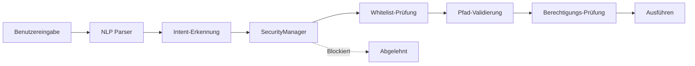

# 🔒 Sicherheitsbericht

<div align="center">

**Version:** v1.0.0  
**Letzte Aktualisierung:** 2025-12-05 14:30 CET  
**Status:** ✅ Freigegeben für Release

---

### 🛡️ Gesamt-Sicherheitsbewertung

# 🟢 GUT

**Für Einzelbenutzer, lokale Installation**

</div>

---

## 📊 Zusammenfassung

<table>
<tr>
<td width="25%" align="center">

### 🟡 1
**Mittleres Risiko**
<br/><sub>Abgemildert</sub>

</td>
<td width="25%" align="center">

### 🟢 4
**Niedriges Risiko**
<br/><sub>Akzeptabel</sub>

</td>
<td width="25%" align="center">

### ✅ 5
**Sicherheitsfunktionen**
<br/><sub>Implementiert</sub>

</td>
<td width="25%" align="center">

### 🔴 0
**Kritische Probleme**
<br/><sub>Keine gefunden</sub>

</td>
</tr>
</table>

### ✅ Empfehlung: **FREIGABE** für v1.0.0 Release

**Vorbehalte:**
- 📋 Als "Beta" markieren ✅ Erledigt
- 📝 Bekannte Einschränkungen dokumentieren ✅ Erledigt
- 🔄 Sicherheitshärtung für v1.0.1 planen ✅ Geplant

---

## 🎯 Risikoübersicht

### 🟡 Mittlere Priorität

<details>
<summary><b>1. Shell-Injection-Risiken</b> - <code>core/system_control.py</code></summary>

#### 📍 Speicherort
`core/system_control.py` - Zeilen ~680, ~904, ~1520, ~1539

#### ⚠️ Problem
Mehrere `shell=True` Subprocess-Aufrufe stellen potenzielle Injection-Vektoren dar

#### 🛡️ Aktuelle Schutzmaßnahmen (Alle wirksam)

| Schutzebene | Status | Details |
|-------------|--------|----------|
| **SecurityManager** | ✅ Aktiv | Validiert alle Befehle gegen Whitelist |
| **Whitelist-Programme** | ✅ Aktiv | Nur vordefinierte Programme in `program_paths` |
| **Pfad-Validierung** | ✅ Aktiv | Alle Pfade werden vor Ausführung validiert |
| **NLP-Parser** | ✅ Aktiv | Bereinigt Benutzereingaben vor Befehlsausführung |

#### 🎯 Risikobewertung

```yaml
Wahrscheinlichkeit: NIEDRIG    (Mehrere Validierungsebenen)
Auswirkung:         KRITISCH   (Falls ausgenutzt: beliebige Code-Ausführung)
Ausnutzbarkeit:     NIEDRIG    (Erfordert Umgehung mehrerer Sicherheitsebenen)
Gesamtrisiko:       MITTEL 🟡  (Akzeptabel mit Überwachung)
```

#### 📋 Behebungsplan

| Version | Maßnahme | Zeitplan |
|---------|----------|----------|
| **v1.0.1** | Protokollierung der Befehlsausführung hinzufügen | 1-2 Tage |
| **v1.1.0** | Alle `shell=True` → `shell=False` ersetzen | 1-2 Wochen |
| **v1.1.0** | `SafeShell` Wrapper-Klasse implementieren | 1-2 Wochen |
| **v1.2.0** | Audit-Log für Befehlsausführung + Penetrationstests | 3-4 Wochen |

</details>

### 🟢 Niedrige Priorität

<details>
<summary><b>2. Dateirechte-Erhöhung</b> - Windows <code>attrib</code> Befehl</summary>

**Risiko:** Verwendet `attrib` Befehl zum Ändern von Dateiattributen  
**Abschwächung:** ✅ Alle Pfade werden durch `SecurityManager.ensure_write_permission()` validiert  
**Status:** ✅ Akzeptabel

</details>

<details>
<summary><b>3. Dynamische Programmregistrierung</b> - Windows Verknüpfungs-Indexierung</summary>

**Risiko:** Durchsucht Startmenü nach `.lnk` Dateien  
**Abschwächung:** ✅ Begrenzt auf vertrauenswürdige Verzeichnisse, erfordert explizite Benutzeraktion  
**Status:** ✅ Akzeptabel

</details>

<details>
<summary><b>4. Prozess-Beendigung</b> - Kann Prozesse nach Namen beenden</summary>

**Risiko:** Kann beliebige Prozesse beenden  
**Abschwächung:** ✅ Erfordert `process_control` Berechtigung, Whitelist-basiert  
**Status:** ✅ Akzeptabel

</details>

<details>
<summary><b>5. Notfall-Aktionen</b> - Netzwerktrennung + Workstation-Sperre</summary>

**Risiko:** Denial of Service falls ausgelöst  
**Abschwächung:** ✅ Nur durch Bedrohungserkennung ausgelöst, standardmäßig Dry-Run  
**Status:** ✅ Funktioniert wie vorgesehen

</details>

---

## ✅ Implementierte Sicherheitsfunktionen

### 🛡️ Defense-in-Depth Architektur



### 1️⃣ SecurityManager

**Validiert alle sicherheitskritischen Operationen**

```python
✅ Schreiboperationen        → ensure_write_permission()
✅ Befehlsausführung        → ensure_command_allowed()
✅ Pfadzugriff              → is_path_allowed()
✅ Berechtigungsprüfungen   → can(capability)
```

### 2️⃣ Safe Mode

**Notfall-Lockdown mit Rollback-Fähigkeit**

```python
✅ Netzwerk-Isolation       → _disable_network_adapters()
✅ Schreibschutz            → _enable_write_protection()
✅ Prozess-Beendigung       → _terminate_suspicious_processes()
✅ Standardmäßig Dry-Run    → Keine echten Änderungen in v1.0.0
```

### 3️⃣ Berechtigungs-Snapshots

**Atomare Operationen mit Rollback**

```python
✅ Erfassen vor Änderung    → _capture_permissions()
✅ Wiederherstellen bei Fehler → _restore_permissions()
✅ Audit-Trail              → In System-Logs protokolliert
```

### 4️⃣ Authentifizierung

**Multi-Faktor-Authentifizierung**

```python
✅ Passphrase               → bcrypt Hashing
✅ TOTP 2FA                 → Google Authenticator kompatibel
✅ UI-Overlay               → SecurityView Komponente
```

### 5️⃣ Pfad-Validierung

**Whitelist-basierter Dateisystemzugriff**

```python
✅ Erlaubte Verzeichnisse   → Konfigurierbare Whitelist
✅ Dateigrößenlimits        → Bei Leseoperationen durchgesetzt
✅ Versteckte Dateien       → Optionaler Ausschluss
✅ Symlink-Auflösung        → Normalisierte Pfade
```

---

## 📊 Risiko-Matrix

| Problem | Wahrscheinlichkeit | Auswirkung | Ausnutzbarkeit | Risikostufe | Status |
|---------|:------------------:|:----------:|:--------------:|:-----------:|:------:|
| **Shell-Injection** | 🟢 Niedrig | 🔴 Kritisch | 🟢 Niedrig | 🟡 Mittel | 👁️ Überwacht |
| **Dateirechte** | 🟢 Sehr niedrig | 🟡 Mittel | 🟢 Sehr niedrig | 🟢 Niedrig | ✅ OK |
| **Prozess-Kill** | 🟢 Sehr niedrig | 🟢 Niedrig | 🟢 Sehr niedrig | 🟢 Niedrig | ✅ OK |
| **Dynamische Programme** | 🟢 Niedrig | 🟢 Niedrig | 🟢 Niedrig | 🟢 Niedrig | ✅ OK |
| **Notfall-Aktionen** | 🟢 Sehr niedrig | 🟡 Mittel | N/A | 🟢 Niedrig | ✅ Beabsichtigt |

### Warum ist die Wahrscheinlichkeit NIEDRIG?

- ✅ Privates Repository (nur Entwickler-Zugriff)
- ✅ Nur lokale Installation (kein Remote-Zugriff)
- ✅ Mehrere Validierungsebenen (SecurityManager)
- ✅ Whitelist-basierte Befehlsausführung
- ✅ Keine direkte Benutzer-zu-Shell-Pipeline

---

## 🗓️ Sicherheits-Roadmap

### v1.0.1 - Sicherheitshärtung
**Zeitplan:** 1-2 Tage | **Priorität:** HOCH

- [ ] Audit aller Benutzereingabe-Flows
- [ ] Persistente Protokollierung der Befehlsausführung hinzufügen
- [ ] SecurityManager Whitelist-Abdeckung verifizieren
- [ ] Vollständiges Exception-Handling-Audit

### v1.1.0 - Shell-Sicherheit
**Zeitplan:** 1-2 Wochen | **Priorität:** MITTEL

- [ ] Alle `shell=True` durch `shell=False` ersetzen
- [ ] `SafeShell` Wrapper-Klasse implementieren
- [ ] `system_control.py` in sichere Module aufteilen

### v1.2.0 - Audit & Testing
**Zeitplan:** 3-4 Wochen | **Priorität:** MITTEL

- [ ] Audit-Log für Befehlsausführung implementieren
- [ ] Unit-Tests für alle Shell-Operationen
- [ ] Externe Penetrationstests
- [ ] Sicherheits-Regressionstests

---

## 🧪 Angriffsvektor-Analyse

### Szenario 1: Bösartiger Sprachbefehl

```yaml
Angriff:
  Eingabe: "Öffne Programm namens '; rm -rf /'"
  
Abwehrkette:
  1. NLP Parser:       → intent='open_program', program='; rm -rf /'
  2. SecurityManager:  → ensure_command_allowed()
  3. Whitelist-Check:  → ❌ ABGELEHNT (nicht in program_paths)
  
Ergebnis: ✅ BLOCKIERT
Risiko:   🟢 SICHER
```

### Szenario 2: Bösartige Windows-Verknüpfung

```yaml
Angriff:
  Setup:  Platziere malicious.lnk im Startmenü
  Aktion: Benutzer sagt "Öffne malicious"
  
Abwehrkette:
  1. Verknüpfung indexiert (begrenzt auf vertrauenswürdige Verzeichnisse)
  2. Benutzer muss explizit nach Namen fragen
  3. Social Engineering erforderlich
  
Ergebnis: 🟡 TEILRISIKO
Risiko:   🟢 NIEDRIG (erfordert lokalen Zugriff + Social Engineering)
```

### Szenario 3: Pfad-Injection

```yaml
Angriff:
  Eingabe: path = "datei.txt & bösartiger_befehl"
  
Abwehrkette:
  1. SecurityManager:   → ensure_write_permission(path)
  2. Path.resolve():    → Normalisiert Pfad
  3. Whitelist-Check:   → Validiert gegen erlaubte Verzeichnisse
  4. Eingabe-Validierung: → Lehnt Shell-Metazeichen ab
  
Ergebnis: ✅ BLOCKIERT
Risiko:   🟢 SICHER
```

---

## 📝 Audit-Metadaten

<details>
<summary><b>Audit-Details</b></summary>

### Analysierte Dateien
- `core/system_control.py` (~1600 Zeilen)
- `core/security_manager.py` (~800 Zeilen)
- `main.py` (Einstiegspunkt)
- `config/settings.py` (Konfiguration)
- `desktop/backend/internal/bridge/jarviscore.go` (Token-Handling)

### Methodik
- ✅ Manuelle Code-Review
- ✅ Statische Analyse (Mustererkennung)
- ✅ Bedrohungsmodellierung
- ✅ Angriffsvektor-Simulation
- ✅ Defense-in-Depth-Validierung

### Audit-Dauer
**2 Stunden** (manuelle Review + Dokumentation)

### Verwendete Tools
- GitHub Code-Suche
- grep/regex Mustererkennung
- Manuelle Bedrohungsmodellierung

</details>

---

## ✅ Endgültiges Urteil

<div align="center">

### 🎯 FREIGEGEBEN FÜR v1.0.0 RELEASE

**System-Status:** 🟢 Sicher für beabsichtigten Anwendungsfall

---

#### Erfüllte Anforderungen

| Anforderung | Status |
|-------------|:------:|
| Als Beta markieren | ✅ Erledigt |
| Einschränkungen dokumentieren | ✅ Erledigt |
| Sicherheits-Audit | ✅ Erledigt |
| Roadmap für Fixes | ✅ Erledigt |

---

### 🎓 Zusammenfassung der Sicherheitslage

**Stärken:**
- ✅ Mehrere Validierungsebenen (Defense-in-Depth)
- ✅ Whitelist-basierte Zugriffskontrolle
- ✅ Keine Remote-Zugriffsvektoren
- ✅ Safe Mode mit Rollback-Fähigkeit

**Verbesserungsbereiche:**
- 🟡 Shell-Befehlsausführung (geplant für v1.1.0)
- 🟡 Befehlsausführungs-Protokollierung (geplant für v1.0.1)
- 🟢 Generell akzeptabel für lokale Installation

**Empfehlung:**  
Das System ist **produktionsreif** für Einzelbenutzer, lokale Installation.  
Fortsetzung der Sicherheitshärtung in kommenden Releases.

---

<sub>Automatisiertes Sicherheits-Audit + Manuelle Review</sub>  
<sub>2025-12-05 14:30 CET</sub>

</div>

---

## 📞 Probleme melden

Sicherheitslücke gefunden?

- 🔒 **Privater Report:** Email an emeyer@fn.de
- 🐛 **Allgemeine Probleme:** [GitHub Issues](https://github.com/Lautloserspieler/JarvisCore/issues)
- 📖 **Dokumentation:** [Bekannte Einschränkungen](KNOWN_LIMITATIONS.md)

**Bitte melden Sie Sicherheitsprobleme privat vor öffentlicher Offenlegung.**
